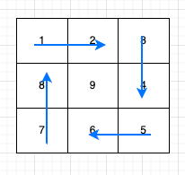

#59. 螺旋矩阵 II


给你一个正整数 n ，生成一个包含 1 到 n2 所有元素，且元素按顺时针顺序螺旋排列的 n x n 正方形矩阵 matrix 。


示例 1：

```json
输入：n = 3
输出：[[1,2,3],[8,9,4],[7,6,5]]
```

示例 2：
```json
输入：n = 1
输出：[[1]]
```


提示：
```json
1 <= n <= 20
```

##思路

需要遍历打印`n/2`圈结束，打印每一圈的时候：
- 打印每一圈需要打印4条边
- 每一条边打印的数字的数量为`m`，`m`随着圈数的变化而变化，圈数为`k(0,1,2...)`，`m=n-k*2-1`
- 打印一圈，每一条边的初始坐标：`(m,m),(m,n-m-1),(n-m-1,n-m-1),(n-m-1,m)`


